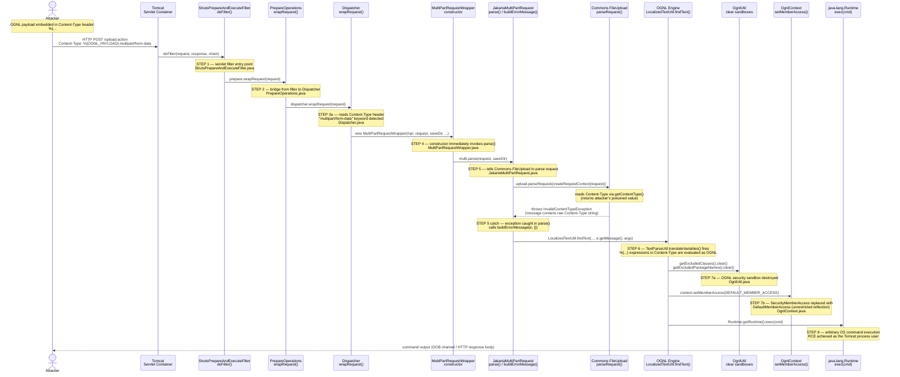

# SC3010-Computer-Security — CVE-2017-5638 Attack Recreation

This repository is part of the [SC3010 Computer Security course project](https://github.com/Shuhui95/SC3010-Case-Study).  
It recreates **CVE-2017-5638**, a critical Remote Code Execution vulnerability in Apache Struts 2 (versions 2.3.5–2.3.31 and 2.5–2.5.10), famously exploited in the **2017 Equifax data breach** to exfiltrate personal records of roughly 147 million people.

The vulnerability arises from a single design flaw: when Apache Struts fails to parse a `multipart/form-data` upload request, it builds an error message by embedding the raw `Content-Type` header — without sanitizing it — into a string that is then passed through the OGNL expression evaluator. An attacker who puts an OGNL expression inside the `Content-Type` header therefore gets it executed server-side as the Tomcat process user.

This repo contains:
- A working **vulnerable Java/Maven server** (Struts2 2.3.28) with a file-upload endpoint.
- A **PowerShell exploit script** that demonstrates the full injection → RCE chain.
- Annotated **reference source files** from Apache Struts 2.3.28 mapping each step of the call chain.

---
## Pre-knowledge
- [How does OGNL injection work?](_note/OGNL-injection-introduction.md)
---

## Repository Structure

```
SC3010-Computer-Security/
├── attack-recreate/
│   ├── backend/          # Vulnerable Apache Struts2 2.3.28 server (Java/Maven)
│   └── attack-script/    # Exploit script for CVE-2017-5638
│       └── exploit_cve_2017_5638.ps1   # PowerShell (cross-platform)
├── struts-src-code/          # Apache Struts2 reference source + legal notices
│   ├── licenses/             # LICENSE, NOTICE, and component licenses
│   └── src/
│       ├── struts2-core/     # Request pipeline classes + vulnerable JakartaMultiPartRequest
│       ├── xwork2/           # ActionContext.java, OgnlUtil.java
│       └── ognl/             # OgnlContext.java
├── state-machine-diagram/    # Mermaid attack sequence diagram + annotated OGNL payload
└── _notes/                   # Background reading
```

---
## Attack Simulation
* See [attack-recreate/attack-script/README.md](attack-recreate/attack-script/README.md) for setup and usage instructions.

---
## Attack Call Chain Diagram

The diagram below traces a single malicious HTTP POST from the attacker to arbitrary OS command execution on the server.  
For the full payload breakdown and source-file table, see [state-machine-diagram/cve-2017-5638-attack-chain.md](state-machine-diagram/cve-2017-5638-attack-chain.md).


---

## Third-Party Software Notices

This repository reproduces portions of **Apache Struts 2.3.28** source code for academic security research purposes.

> Apache Struts is Copyright © 2000–2016 The Apache Software Foundation.  
> Licensed under the **Apache License, Version 2.0**.  
> A copy of the license is available at [`struts-src-code/licenses/LICENSE.txt`](struts-src-code/licenses/LICENSE.txt).  
> The full attribution notice required by the Apache License is in [`struts-src-code/licenses/NOTICE.txt`](struts-src-code/licenses/NOTICE.txt).

Apache Struts 2 bundles additional third-party components, each governed by their own license:

| Component | License file |
|-----------|--------------|
| OGNL (Object-Graph Navigation Library) | [`struts-src-code/licenses/OGNL-LICENSE.txt`](struts-src-code/licenses/OGNL-LICENSE.txt) |
| XWork | [`struts-src-code/licenses/XWORK-LICENSE.txt`](struts-src-code/licenses/XWORK-LICENSE.txt) |
| FreeMarker | [`struts-src-code/licenses/FREEMARKER-LICENSE.txt`](struts-src-code/licenses/FREEMARKER-LICENSE.txt) |

---

Source and repository references:
- [apache/struts @ STRUTS\_2\_3\_28](https://github.com/apache/struts/tree/STRUTS_2_3_28) — Struts2 core and XWork
- [jkuhnert/ognl](https://github.com/jkuhnert/ognl) — OGNL 3.0.x
- [Gemini](https://gemini.com/) — Consultation on general OGNL injection.
---
