```mermaid
flowchart TD
    Start([Attacker sends HTTP POST /upload.action<br/>Content-Type: &#37;&#123;OGNL_PAYLOAD&#125;.multipart/form-data])
    Start --> F1

    F1[/"<b>STEP 1</b><br/>StrutsPrepareAndExecuteFilter.doFilter()"/]
    F1 --> D1{URL in excludedPatterns?}
    D1 -- "Yes → chain.doFilter() ..." --> OUT1([normal servlet chain ...])
    D1 -- No --> F2

    F2[/"<b>STEP 2</b><br/>PrepareOperations.wrapRequest()"/]
    F2 --> F3

    F3[/"<b>STEP 3</b><br/>Dispatcher.wrapRequest()<br/>reads request.getContentType()"/]
    F3 --> D2{"Content-Type contains<br/>&quot;multipart/form-data&quot;?"}
    D2 -- "No → StrutsRequestWrapper ..." --> OUT2([normal non-upload request ...])
    D2 -- "Yes (attacker's payload still<br/>contains the keyword)" --> F4

    F4[/"<b>STEP 4</b><br/>new MultiPartRequestWrapper(mpr, request, saveDir, ...)<br/>constructor calls multi.parse()"/]
    F4 --> F5

    F5[/"<b>STEP 5</b><br/>JakartaMultiPartRequest.parse()<br/>→ Commons FileUpload.parseRequest()"/]
    F5 --> D3{"FileUpload can parse<br/>Content-Type?"}
    D3 -- "Yes → normal file upload ..." --> OUT3([files extracted, action executes ...])
    D3 -- "No — Content-Type is malformed<br/>throws InvalidContentTypeException<br/>(message = raw Content-Type string)" --> CATCH

    CATCH["parse() catch block<br/>calls buildErrorMessage(e, &#123;&#125;)"]
    CATCH --> F6

    F6[/"<b>STEP 6</b><br/>JakartaMultiPartRequest.buildErrorMessage()<br/>→ LocalizedTextUtil.findText(class, errorKey, locale, e.getMessage(), args)"/]
    F6 --> D4{"Resource bundle has key<br/>struts.messages.upload.error.*?"}
    D4 -- "Yes → safe localised message ..." --> OUT4([error displayed safely ...])
    D4 -- "No — falls back to<br/>e.getMessage() as the default<br/>(attacker's raw Content-Type)" --> TRANSLATE

    TRANSLATE["TextParseUtil.translateVariables()<br/>scans string for &#37;&#123;...&#125; expressions"]
    TRANSLATE --> D5{"String contains<br/>&#37;&#123;...&#125; OGNL expression?"}
    D5 -- "No → plain error string ..." --> OUT5([safe error message ...])
    D5 -- "Yes — evaluates OGNL<br/>inside attacker content" --> OGNL

    OGNL[/"<b>STEP 7a — OGNL sandbox bypass</b><br/>#ognlUtil.getExcludedClasses().clear()<br/>#ognlUtil.getExcludedPackageNames().clear()<br/><i>OgnlUtil.java</i>"/]
    OGNL --> ACCESS

    ACCESS[/"<b>STEP 7b — Unrestricted reflection</b><br/>#context.setMemberAccess(DEFAULT_MEMBER_ACCESS)<br/><i>OgnlContext.java</i>"/]
    ACCESS --> RCE

    RCE[/"<b>STEP 8 — RCE</b><br/>Runtime.getRuntime().exec(cmd)"/]
    RCE --> Done([Command executed as Tomcat process user])

    style Start fill:#d32f2f,color:#fff
    style Done fill:#d32f2f,color:#fff
    style OUT1 fill:#9e9e9e,color:#fff
    style OUT2 fill:#9e9e9e,color:#fff
    style OUT3 fill:#9e9e9e,color:#fff
    style OUT4 fill:#9e9e9e,color:#fff
    style OUT5 fill:#9e9e9e,color:#fff
    style OGNL fill:#b71c1c,color:#fff
    style ACCESS fill:#b71c1c,color:#fff
    style RCE fill:#b71c1c,color:#fff
    style CATCH fill:#e65100,color:#fff
    style TRANSLATE fill:#e65100,color:#fff
```

# CVE-2017-5638 — Attack State Machine

Decision-branch diagram of the Struts2 request pipeline. Each diamond is a branch point
where the vulnerability **could** have been caught by a defensive measure. The red path is
the one the attacker forces; grey `→ ...` branches are normal/safe paths that don't apply
during the exploit.

---

---

## Why each branch goes the "wrong" way

| Step | Branch | Why the attacker wins |
|------|--------|-----------------------|
| 1 | URL excluded? → **No** | `/upload.action` is a normal Struts endpoint, not excluded |
| 3 | Contains `multipart/form-data`? → **Yes** | Attacker appends `.multipart/form-data` at the end of the OGNL payload |
| 5 | FileUpload can parse? → **No** | The rest of the Content-Type is garbage OGNL — Commons FileUpload rejects it |
| 6 | Resource key found? → **No** | The error key is constructed from the exception class name; no bundle match → falls back to `e.getMessage()` |
| 6→7 | Contains `%{...}`? → **Yes** | The attacker's entire payload is a `%{...}` OGNL expression |

## The fix (Struts 2.3.32 / 2.5.10.1)

The patch sanitises the error message **before** it reaches `LocalizedTextUtil.findText()`, ensuring `%{...}` tokens from the raw Content-Type are never evaluated as OGNL.
